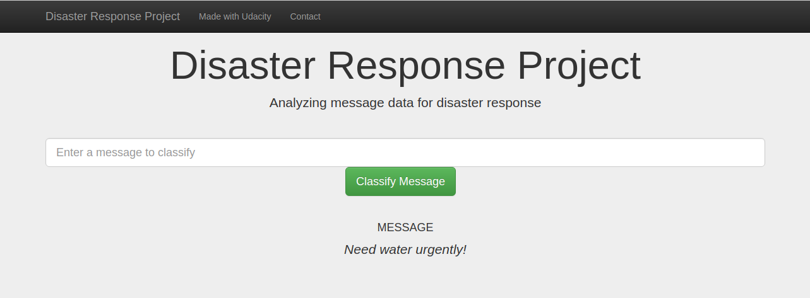
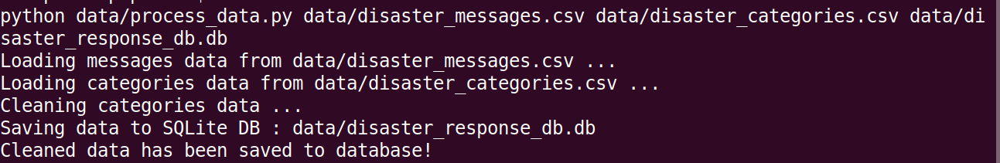

# Disaster_response

## Table of Contents
1. [Description](#description)
2. [Getting Started](#getting_started)
	1. [Dependencies](#dependencies)
	2. [Executing Program](#execution)
	3. [Additional Material](#material)
3. [Acknowledgement](#acknowledgement)
4. [Screenshots](#screenshots)

## 1. Description

This Project is part of Data Science Nanodegree Program by Udacity in collaboration with Figure Eight. The dataset contains pre-labelled tweet and messages from real-life disaster events. The project aim is to build a Natural Language Processing (NLP) model to categorize messages on a real time basis.

This project is divided in the following key sections:

1. Processing data, building ETL pipeline to extract data from source, clean the data and save them in a SQLite DB.
2. Build a machine learning pipeline which can classify text message in various categories.
3. Run a web app which can take user input and show the classified model results in real time.

## 2. Getting Started

### Dependencies
* Python 3.5+
* Machine Learning Libraries: NumPy, SciPy, Pandas, Sciki-Learn
* Natural Language Process Libraries: NLTK
* SQLlite Database Libraqries: SQLalchemy
* Model Loading and Saving Library: Pickle
* Web App and Data Visualization: Flask, Plotly

### Executing Program
1. Run the following commands in project's directory to set up the database, train model and save the model.
    - To run ETL pipeline to clean data and store the processed data in the database 
        `python data/process_data.py data/disaster_messages.csv data/disaster_categories.csv data/disaster_response_db.db` 
	The ETL pipeline is in process_data.py.The next two arguments are input data and the last argument is the SQLite Database in which we want to save the cleaned data. 		DisasterResponse.db already exists in data folder but the above command will still run and replace the file with same information.
	
    - To run the ML pipeline that loads data from DB, trains classifier and saves the classifier as a pickle file 
        `python models/train_classifier.py data/disaster_response_db.db models/classifier.pkl`  
	This will use cleaned data to train the model, improve the model with grid search and saved the model to a pickle file (classifer.pkl). 
	classifier.pkl already exists but the above command will still run and replace the file will same information.

2. Run the following command in the app's directory to run your web app. 
    `python run.py` 
    This will start the web app and will direct you to a URL (http://0.0.0.0:3001/) where you can enter messages and get classification results for it.

### Additional Material

In the **data** and **models** folder, the two jupyter notebooks that will help to understand how the model works:
1. **ETL Preparation Notebook**: learn everything about the implemented ETL pipeline
2. **ML Pipeline Preparation Notebook**: look at the Machine Learning Pipeline developed with NLTK and Scikit-Learn

You can use **ML Pipeline Preparation Notebook** to re-train/tune the model through a dedicated Grid Search.

### Important Files
**app/templates/***: templates/html files for web app

**data/process_data.py**: ETL pipeline for data cleaning, feature extraction, and storing data in a SQLite database

**models/train_classifier.py**: ML pipeline to load data, train model and save trained model as a .pkl file.

**run.py**: This file can be used to launch the Flask web app used to classify disaster messages

## 3. Acknowledgements

* [Udacity](https://www.udacity.com/) for providing an amazing Data Science Nanodegree Program
* [Figure Eight](https://www.figure-eight.com/) for providing the relevant dataset to train the model

## 4. Screenshots

1. This is an example of a message we can type to test the performance of the model

2. After clicking **Classify Message**, we can see the categories which the message belongs to highlighted in green

3. The main page shows some graphs about training dataset, provided by Figure Eight

4. Sample run of process_data.py

5. Sample run of train_classifier.py

6. Sample run of train_classifier.py with precision, recall etc. for each category

